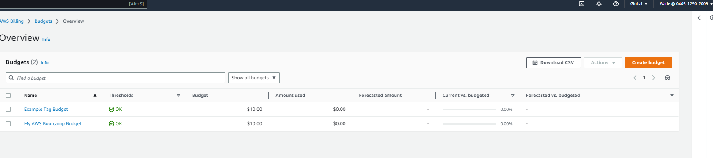
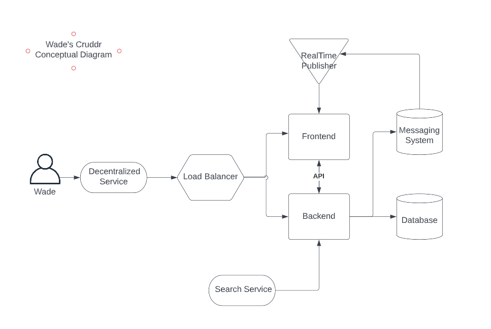
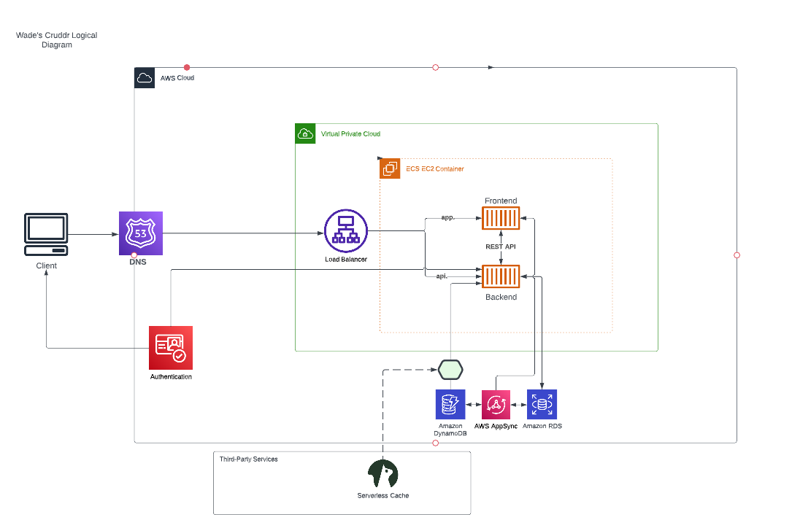

# Week 0 — Billing and Architecture

## Required Homework

### Install AWS CLI

I installed the AWS CLI using Gitpod. gitpod.yml is located in Main: [The yml file is located here](../.gitpod.yml)

### Create a Billing Alarm

### Create a Budget

I created one budget using the AWS console (10.00) and another $1 budget using Gitpod.

### Recreate Conceptual Architectural Design

I recreated the Conceputal Architectural Diagram in Lucid Charts

### Recreate Logical Architectural Design

I recreated the Logical Architectural Diagram in Lucid Charts

<a href="https://lucid.app/lucidchart/efe7fdc0-01b8-447e-93ba-d717e45fe719/edit?viewport_loc=-3692%2C-442%2C3328%2C1548%2C0_0&invitationId=inv_30790980-f079-4b21-9a08-10a9e5355285" target="_blank">Link to shared Lucid Architectural and Concept Diagrams in one Lucid Document</a>
